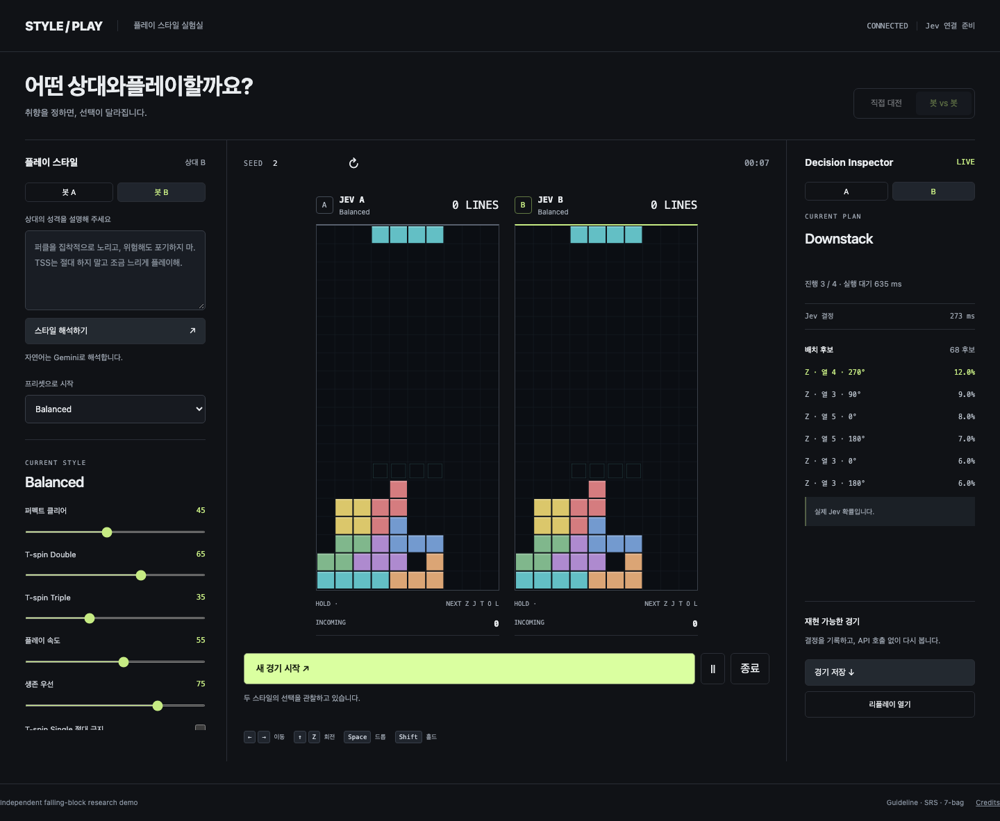

# Jet Style Tetris

A falling-block AI demo focused on **personality, not perfect play**. Describe an opponent, tune its preferences, and watch its decisions change.

**[Demo](https://jet-style-tetris.vercel.app)** · [Deployment](docs/deployment.md) · [Architecture](docs/architecture.md)



## What it does

- Play against an agent, or watch two independently configured agents compete.
- Compile natural language into a strict style profile with Gemini; edit the same profile with sliders and presets.
- Let Jev choose strategies, plans, and placements from engine-validated candidates.
- Explore PC, TSD/TST, 6-3 and 9-0 stacking, openers, downstacking, and small showpiece builds.
- Inspect real decision probabilities and save deterministic, API-free replays.

The Rust game engine handles legality and simulation. Jev handles preferences. Absolute prohibitions remove candidates before selection. Provider failures use a visibly labeled fallback; they never produce invented model probabilities.

## Run locally

Requires Node.js 22.16+ and Rust 1.98.1. The interface is currently in Korean.

```bash
GIT_LFS_SKIP_SMUDGE=1 git clone --recurse-submodules https://github.com/Blueslime0216/Jet-Style-Tetris.git
cd Jet-Style-Tetris
npm ci
cp .env.example .env
npm run build
npm start
```

Open **http://127.0.0.1:3123**. Add `JEV_API_KEY` and `GEMINI_API_KEY` to `.env` to enable the providers. Without keys, presets and fallback gameplay remain available.

```bash
npm test
npm run test:engine
npm run check
npm run tbp                  # Tetris Bot Protocol over stdin/stdout
```

## Deploy to Vercel

Import this repository with **Framework Preset: Other** and **Fluid Compute enabled**. The repository includes the build command, a 300-second WebSocket function, and the native engine bundle configuration.

Set `SESSION_SECRET` to a random secret of at least 32 characters. For live AI, add the two provider keys and connect Upstash Redis using `UPSTASH_REDIS_REST_URL` and `UPSTASH_REDIS_REST_TOKEN`. The Marketplace aliases `KV_REST_API_URL` and `KV_REST_API_TOKEN` are also supported. Redis enforces a shared API request budget across function instances. If it is missing or unavailable, paid provider calls are blocked and gameplay falls back safely.

See [deployment instructions](docs/deployment.md) for all variables and limitations. Vercel WebSockets are currently a beta feature; a production deployment still needs a smoke test after import.

## Scope

This is an early demo: short lookahead, a curated static knowledge library, and basic opener routes. All-Spin, broad meme coverage, and advanced opponent-pattern recognition are future work. Reserved controls are marked unavailable. Gemini quota errors preserve the previous style.

Built on the MIT-licensed [tetr_online](https://github.com/xiyan128/tetr_online) core, pinned as a submodule. Upstream audio and model assets are not used. See [third-party notices](THIRD_PARTY_NOTICES.md) and [knowledge sources](knowledge/README.md).
